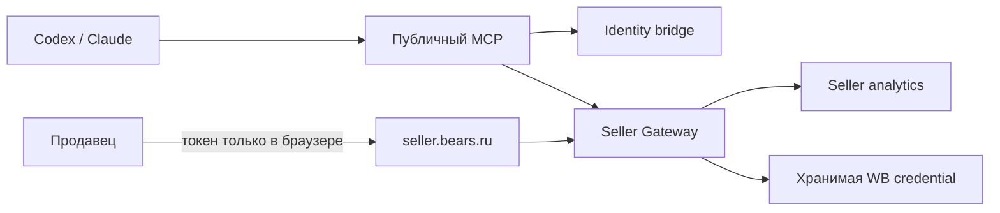

# Wildberries Agent Integration

<p align="center">
  
</p>

<p align="center"><strong>Бесплатная русскоязычная аналитика Wildberries для Codex, Claude и MCP-клиентов</strong></p>

<p align="center">
  <a href="https://github.com/BearsCLOUD/wildberries-agent-integration/actions/workflows/ci.yml"></a>
  <a href="https://github.com/BearsCLOUD/wildberries-agent-integration/releases"></a>
  <a href="https://github.com/BearsCLOUD/wildberries-agent-integration"></a>
  <a href="LICENSE"></a>
</p>

<p align="center">
  
</p>

Плагин соединяет агента с Seller и даёт продавцу понятный путь от вопроса к числу и следующему действию:
продажи, остатки, конкуренты, цены, регионы, SEO, контент карточки, юнит-экономика и пополнение.
Агентский функционал бесплатен: у проекта нет платы за лицензию, место пользователя или вызов инструмента.

## В двух словах

- 16 русскоязычных навыков и 14 MCP-инструментов.
- Безопасное подключение поставщика через `seller.bears.ru`: исходный WB-токен не вводится в чат.
- Отдельный калькулятор пополнения и прогноз «сколько и куда везти».
- Конкурентный анализ, ценовой коридор, продажи по доступному региональному полю, погодные гипотезы и SEO-оценка.
- Подготовка карточки, дизайн-системы и фото товара — без автоматической публикации в Wildberries.
- MIT, открытый исходный код, бесплатная агентская поверхность.

## Калькулятор и пополнение

Это центральный операционный сценарий плагина:

1. `wb_replenishment_math` быстро считает количество единиц по дневному спросу, остатку, товару в пути и целевому покрытию.
2. `wb_inventory_forecast` учитывает доступные остатки и спрос, предлагает направления по складам или регионам и показывает допущения.
3. Если складская география недоступна, результат честно помечается как региональная эвристика — без выдуманного распределения.

Калькуляторы ничего не заказывают и не меняют остатки. Это воспроизводимая рекомендация для планирования.

## Возможности

| Группа | Что умеет агент |
| --- | --- |
| Аналитика | Продажи, заказы, финансы, цены, остатки и сводки за период |
| Решения | Юнит-экономика, маржа, точка безубыточности, цена и пополнение |
| Рынок | Явно переданные наблюдения конкурентов и конкурентный ценовой коридор |
| Репутация | Отзывы, средняя оценка, повторяющиеся жалобы и список без ответа |
| География | Продажи в разрезе товара и доступного региона; локальные дефициты |
| Гипотезы | Сопоставление продаж с погодой без заявления причинности |
| Контент | SEO-проверка, структура карточки, дизайн-система и варианты фото |
| Интеграция | Защищённая регистрация, запись себестоимости и allowlist Seller Gateway |

### MCP-инструменты

| Инструмент | Назначение |
| --- | --- |
| `wb_connect_supplier` | Открыть защищённый сценарий подключения поставщика |
| `wb_list_suppliers` | Показать поставщиков текущего пользователя |
| `wb_analytics_summary` | Сводка продаж, заказов, финансов, цен и остатков |
| `wb_warehouse_stock` | Остатки по товару и складам |
| `wb_wildberries_proxy` | Фиксированные операции Seller Gateway, включая очередь обновления аналитики |
| `wb_competitor_analysis` | Сравнение с явно переданными конкурентами |
| `wb_competitive_price` | Коридор цены и проверяемые сценарии |
| `wb_sales_by_region` | Продажи по доступному региональному полю |
| `wb_sales_weather_impact` | Корреляция продаж и погодных рядов |
| `wb_seo_analytics` | Проверка контента карточки и поисковых ключей |
| `wb_upload_cost_price` | Запись указанной себестоимости в Seller |
| `wb_unit_economics` | Маржа, безубыточность и сценарии |
| `wb_replenishment_math` | Быстрый расчёт количества пополнения |
| `wb_inventory_forecast` | Прогноз количества и направлений пополнения |

## Быстрый старт

### Codex

```bash
git clone https://github.com/BearsCLOUD/wildberries-agent-integration.git
cd wildberries-agent-integration
codex plugin marketplace add ./.agents/plugins
codex plugin add wildberries-agent-integration@wildberries-agent
```

Каталог плагина описан в `.agents/plugins/marketplace.json`, манифест — в
`plugins/wildberries-agent-integration/.codex-plugin/plugin.json`.

### Claude

Для локального Claude Code подключите MCP-команду из корня репозитория:

```bash
claude mcp add --transport stdio wildberries-agent -- \
  python3 "$PWD/plugins/wildberries-agent-integration/scripts/run_mcp.py"
```

Манифест Claude находится в `plugins/wildberries-agent-integration/.claude-plugin/plugin.json`,
а готовая конфигурация — в `plugins/wildberries-agent-integration/claude/mcp.json`.
Для проверки манифеста:

```bash
claude plugin validate plugins/wildberries-agent-integration
```

### Локальный MCP

```bash
cd plugins/wildberries-agent-integration
python3 -m venv .venv
. .venv/bin/activate
python3 -m pip install -e .
export APP_ENV=development
export SELLER_GATEWAY_URL=http://127.0.0.1:8000
export SELLER_CONNECT_URL=https://seller.bears.ru/authentication/registration
wildberries-agent-mcp
```

Для Streamable HTTP:

```bash
wildberries-agent-mcp --transport streamable-http --host 127.0.0.1 --port 8080
```

Локальный сервер требует доступный Seller Gateway для авторизованных аналитических вызовов.
В production дополнительно нужны HTTPS и deployment подготовленного OAuth 2.1/PKCE identity bridge:
`SELLER_IDENTITY_BRIDGE_URL`, `MCP_PUBLIC_URL` и `MCP_AUTH_ISSUER`.

## Как устроено подключение



`wb_wildberries_proxy` — не произвольный HTTP-прокси. Агент передаёт только `supplier_id_wb`,
имя разрешённой операции и ограниченный payload. Он не видит токен, URL, HTTP-метод,
путь или заголовки. Seller Gateway проверяет владельца и область поставщика, а затем сам выбирает
хранимую credential. Единственные записи в текущем наборе — явно указанная себестоимость товара
и постановка существующего обновления аналитики Seller в очередь; данные Wildberries не изменяются.

## 16 навыков

Все навыки русскоязычные и лежат в [`plugins/wildberries-agent-integration/skills`](plugins/wildberries-agent-integration/skills/):

`analytics-summary` · `connect-supplier` · `cost-price-upload` · `unit-economics` ·
`replenishment-calculator` · `inventory-forecast` · `competitor-analysis` ·
`competitive-pricing` · `regional-sales` · `weather-impact` · `seo-analytics` ·
`product-card` · `design-system` · `product-photo-generation` · `review-analysis` ·
`wildberries-api`.

Навыки готовят черновики и рекомендации. Публикация карточки, изменение цен и любые необратимые
операции остаются за пределами текущей бесплатной поверхности.

## Ограничения и честный статус

- Конкуренты анализируются только по переданному или разрешённому источнику; полнота рынка не обещается.
- Ценовой коридор описывает выборку, но не доказывает спрос или прибыльность.
- Регион — только фактическое географическое поле источника, а не автоматически выведенный регион покупателя.
- Погода показывает корреляцию совпавших рядов, а не причинное влияние и не прогноз продаж.
- SEO — прозрачная эвристика контента, а не гарантия позиции, CTR или конверсии.
- Внешние данные (конкуренты, погода) требуют совместимого API и соответствующей лицензии.

Исходник и локальный MCP опубликованы; companion Seller source содержит OAuth 2.1/PKCE и
reviewed WB API contracts. Production endpoint рядом с сервером аналитики и карточка
в публичном каталоге ChatGPT/OpenAI требуют deployment, HTTPS/OAuth-реквизитов и проверки
рецензентом. Пока такой функциональный deployment не подтверждён, проект не заявляет
`runtime_accepted` и не выдаёт адрес-заглушку за работающий MCP.

Порядок подачи описан в [`docs/public-listing.md`](docs/public-listing.md), контракт MCP — в
[`docs/mcp-contract.md`](docs/mcp-contract.md), архитектурные ограничения — в [`SPEC.md`](SPEC.md).

## Документация

- [Ландшафт конкурентов и источники](docs/competitive-landscape.md)
- [Identity bridge](docs/identity-bridge.md)
- [Безопасность](SECURITY.md)
- [Приватность](plugins/wildberries-agent-integration/PRIVACY.md)
- [Условия использования](plugins/wildberries-agent-integration/TERMS.md)
- [Поддержка](SUPPORT.md)
- [История изменений](plugins/wildberries-agent-integration/CHANGELOG.md)

## Лицензия

MIT — [LICENSE](LICENSE).
